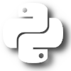

# Scientific Computing with Python

## Index

- [For the sake of Arguments: Functions and Variables](for-the-sake-of-arguments---functions-and-variables)
- [Data Structures and Algorithms](data-structures-and-algorithms)
- [Class is in Session: Object Oriented Programming](class-is-in-session---object-oriented-programming)

## For the sake of Arguments - Functions an Variables

##  - Data Structures and Algorithms

## Class is in Session - Object Oriented Programming