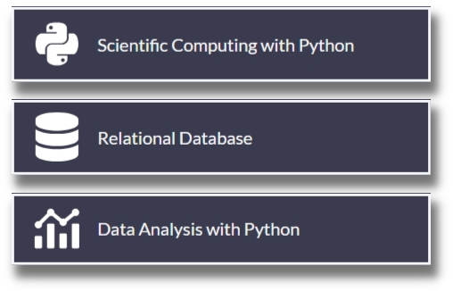

# Scientific Computation and Data Analysis

## Index

- [Hello, Back-End: Exploring the Curriculum](#hello,-back-end---exploring-the-curriculum)
- [For the sake of Arguments: Functions and Variables](for-the-sake-of-arguments---functions-and-variables)
- [Data Structures and Algorithms](data-structures-and-algorithms)
- [Class is in Session: Object Oriented Programming](class-is-in-session---object-oriented-programming)

##  Hello, Back End - Exploring the Curriculum

The Core Curriculum aims to teach full-stack software engineering, which includes various courses on back-end development using technologies such as Python and SQL to build robust and scalable applications.

I have taken these courses in a continued effort to learn Back-End Development and Data Engineering. 

## For the sake of Arguments - Functions and Variables

##  - Data Structures and Algorithms

## Class is in Session - Object Oriented Programming