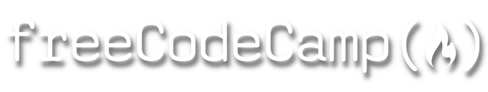

# Scientific Computation and Data Analysis

## Index

- [Hello, Back-End: Exploring the Curriculum](#hello,-back-end---exploring-the-curriculum)

##  Hello, Back End - Exploring the Curriculum

The Core Curriculum aims to teach full-stack software engineering, which includes various courses on back-end development using technologies such as Python and SQL to build robust and scalable applications.

I have taken these courses in a continued effort to learn Back-End Development and Data Engineering. 

## Python Programming

## SQL Databases, Bash Scripts

## Data Analysis

## Certificates

## Conclusion
